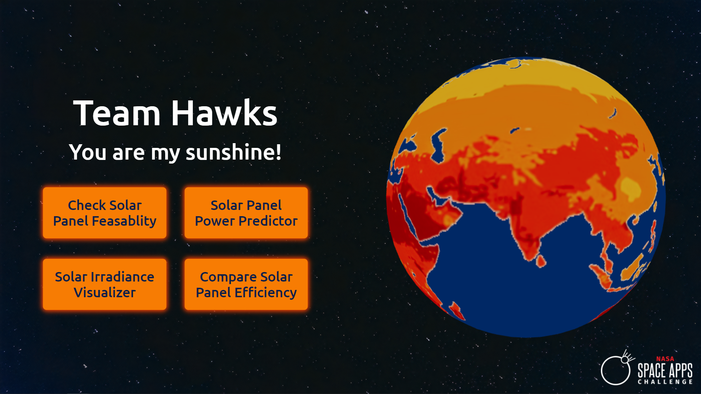
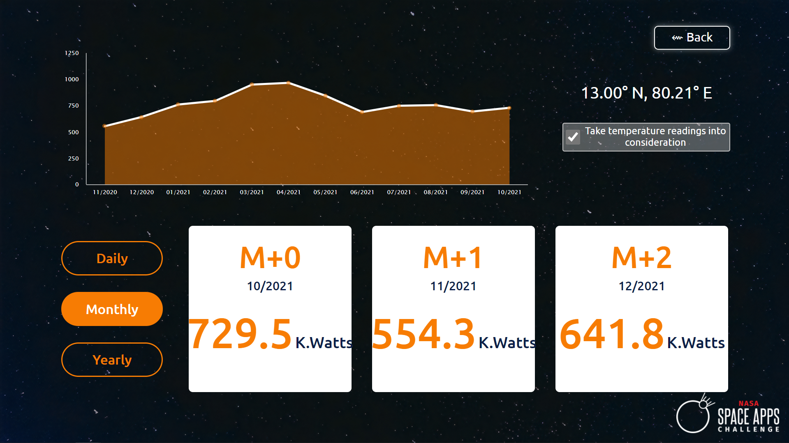
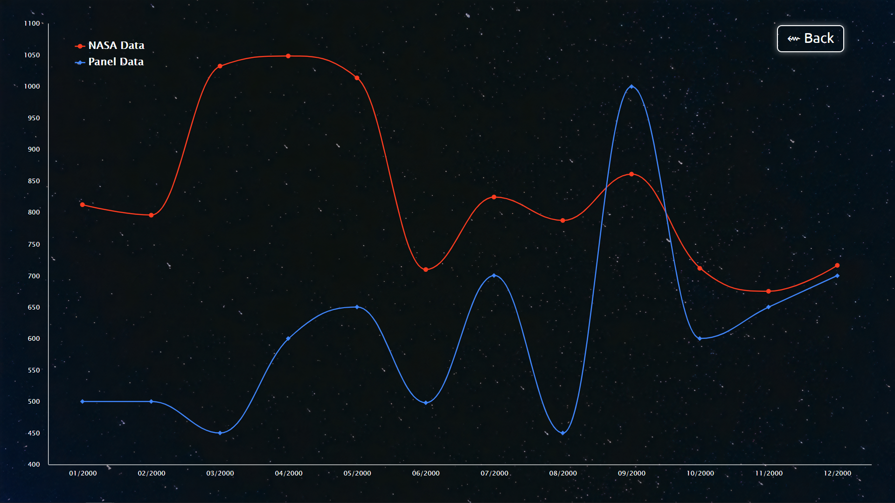
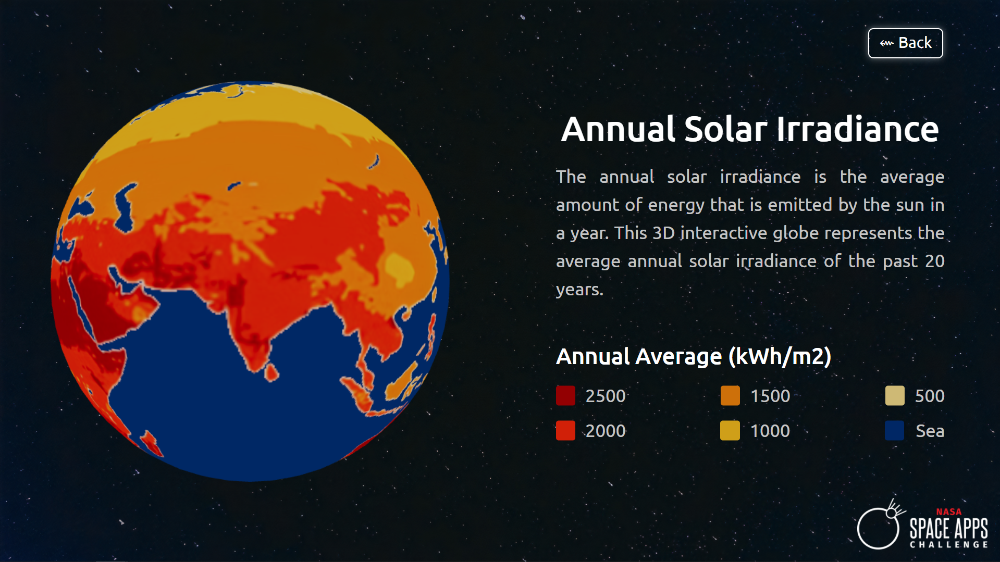

# HEXOLAR by Team Hawks

> ### PPT Link: 
> https://docs.google.com/presentation/d/1I9IAYzVxoGKFhAv0RVfS8HozsTyBmp3DRH7ntCrLFM0/edit?usp=sharing
> ### Short Video: 
> https://youtu.be/FJ5ijRl5q9g
> ### Descriptive Video: 
> https://youtu.be/76lYjs9cOJs

## HIGH-LEVEL PROJECT SUMMARY
Humans are constantly looking for renewable sources of energy. The recent energy crisis in China has led our team to choose this topic. Solar energy is the most important renewable source of energy. Our application works for two use cases. The first is for people who are planning to install solar power in their homes for which we have developed two tools to check the feasibility based on their location. The second is for people who have already installed a solar panel in their home for whom we have developed two tools to predict the solar panel output for the future and to also check the efficiency of the installed solar panel by comparing the power output with NASA's data.

## SPACE AGENCY DATA
We used two datasets from the NASA power web portal.
Link:- https://power.larc.nasa.gov/data-access-viewer/
1) All Sky Surface Shortwave Downward Irradiance
2) Temperature at 2 meters
For our project, the datasets are to be dynamic since the data changes according to the user-specified location. We utilized the power portal's API to fetch data and use the same for training the ML model.

## SCREENSHOTS OF THE WEB APPLICATION

  
  

  
  

## TAGS
#solarpower, #irradiance, #sunshine, #NASA's power, #analytics, #ML, #DataScience, #Electrical, #solarpanel
